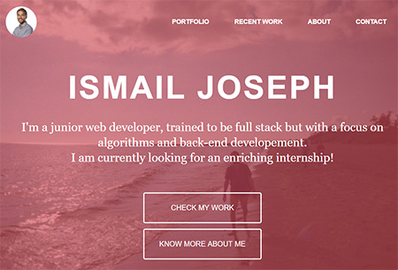
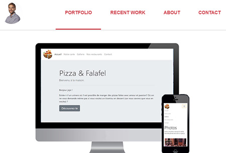
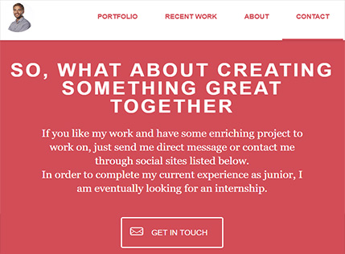

My first portfolio as junior web developer
=================================

By [Ismail Joseph](https://github.com/Fesouille).
----------------------------------

*Portfolio realized in order to promote myself and find an intership as regards to my formation at [BeCode](https://www.becode.org/) to be a Web Developper (Brussels, Belgium)*

* Project:

	* This portfolio sums up all my most relevant work as junior web developer.

* Content:
	* My portfolio is built up with HTML, CSS and JAVASCRIPT (+ JQuery).

* Check it out! :
	* [My first portfolio](https://fesouille.github.io/portfolio/)

* A few illustrating pictures:

